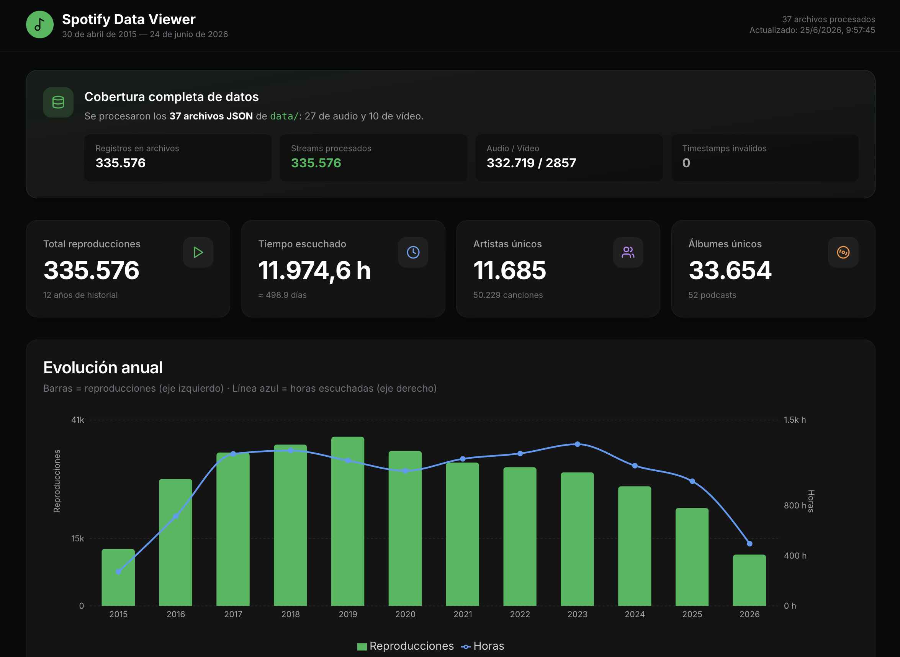

# Spotify Data Viewer



Dashboard local y privado para explorar tu **historial extendido de streaming de Spotify**. Procesa tus archivos JSON, genera estadísticas y las muestra en una interfaz visual — sin subir tus datos a ningún servidor.

---

## ¿Qué puedes ver?

| Sección | Descripción |
|---------|-------------|
| **Resumen** | Reproducciones totales, horas escuchadas, artistas, álbumes y podcasts |
| **Evolución anual** | Reproducciones y horas por año (2015 → hoy) |
| **Tendencia mensual** | Actividad mes a mes |
| **Rankings** | Top 50 artistas, canciones y álbumes (por plays y por tiempo) |
| **Plataformas y países** | iOS, Android, macOS, código de país de conexión |
| **Hábitos** | Skip rate, shuffle, offline, sesión privada |
| **Patrones** | Hora del día y día de la semana |
| **Géneros** *(opcional)* | Tendencia por género a lo largo de los años — requiere API de Spotify |

> Tus datos **nunca salen de tu ordenador**. Todo se procesa en local.

---

## Requisitos

- [Node.js](https://nodejs.org/) **18 o superior**
- Tu exportación de **Extended Streaming History** de Spotify (paso obligatorio antes de usar la app)

---

## Paso 0 — Solicita tus datos a Spotify (obligatorio)

**Sin este paso la app no tiene nada que mostrar.** Spotify no comparte tu historial automáticamente: debes pedirlo tú desde su página de privacidad.

### ¿Qué es esa página?

En [spotify.com/es/account/privacy/](https://www.spotify.com/es/account/privacy/) (Privacidad de la cuenta) Spotify te permite **descargar una copia de tus datos personales**, tal como exige el RGPD. Ahí verás distintos paquetes de datos; el que necesitas se llama **Extended streaming history** (Historial de streaming extendido).

Ese paquete incluye **cada reproducción** de tu cuenta (canciones, podcasts, vídeo, etc.) con fecha, duración, plataforma, país y más metadatos en archivos JSON.

### Cómo solicitarlo (paso a paso)

1. Entra en **[Privacidad de la cuenta de Spotify](https://www.spotify.com/es/account/privacy/)** e inicia sesión.
2. Baja hasta la sección **Descargar tus datos** (o *Download your data*).
3. Marca la casilla **Extended streaming history** / *Historial de streaming extendido*.
   - No confundir con *Account data* o *Streaming history* básico: necesitas el **extendido**.
4. Pulsa **Solicitar datos** / *Request data*.
5. Spotify preparará el paquete. **Puede tardar desde unos días hasta 30 días**; te avisarán por email.
6. Cuando llegue el correo, abre el enlace de descarga y guarda el **archivo ZIP** en tu ordenador.

### Qué contiene el ZIP

Al descomprimirlo verás una carpeta con archivos como:

```
MyData/
├── Streaming_History_Audio_2015.json
├── Streaming_History_Audio_2016.json
├── Streaming_History_Audio_2016_1.json
├── Streaming_History_Video_2024.json
├── ReadMeFirst_ExtendedStreamingHistory.pdf
└── ...
```

Cada JSON es una lista de reproducciones. Spotify parte el historial en varios archivos (~12 MB cada uno) si tienes muchas escuchas.

---

## Inicio rápido

### 1. Clona o descarga el proyecto

```bash
git clone https://github.com/crm107-ua/spotify-data-viewer.git
cd spotify-data-viewer
```

### 2. Instala dependencias

```bash
npm install
```

### 3. Importa tus datos en la app

Cuando tengas el ZIP de Spotify descargado:

1. **Descomprime** el archivo ZIP en cualquier carpeta.
2. **Copia todos los archivos** `Streaming_History_*.json` a la carpeta `data/` de este proyecto.
3. La estructura debe quedar así:

```
spotify-data-viewer/
└── data/
    ├── Streaming_History_Audio_2015.json
    ├── Streaming_History_Audio_2016.json
    ├── Streaming_History_Audio_2016_1.json
    ├── Streaming_History_Video_2024.json
    ├── ReadMeFirst_ExtendedStreamingHistory.pdf   ← opcional (documentación de campos)
    └── ...
```

**Importante al importar:**

| Regla | Detalle |
|-------|---------|
| Nombres de archivo | No los renombres; deben empezar por `Streaming_History_` |
| Cantidad | Es normal tener muchos archivos (audio + vídeo, varios por año) |
| PDF | El `ReadMeFirst_*.pdf` es opcional; la app lee solo los JSON |
| Actualizar datos | Vuelve a solicitar el historial en Spotify, copia los JSON nuevos y ejecuta `npm run aggregate` |
| Privacidad | La carpeta `data/` está en `.gitignore` — tus datos no se suben a Git |

### 4. Arranca el dashboard

```bash
npm run dev
```

Abre **http://localhost:3000** en el navegador.

La primera vez procesará todos los JSON y generará `public/stats.json`. Si añades datos nuevos, vuelve a ejecutar `npm run aggregate` o reinicia con `npm run dev`.

---

## Géneros (opcional)

El export de Spotify **no incluye géneros musicales**. Para ver la sección *"Tendencia de géneros a lo largo de los años"*:

1. Copia el archivo de ejemplo:
   ```bash
   cp .env.example .env
   ```
2. Crea una app en el [Spotify Developer Dashboard](https://developer.spotify.com/dashboard).
3. Añade tus credenciales al `.env`:
   ```env
   SPOTIFY_CLIENT_ID=tu_client_id
   SPOTIFY_CLIENT_SECRET=tu_client_secret
   ```
4. Ejecuta de nuevo:
   ```bash
   npm run aggregate
   npm run dev
   ```

La primera consulta a la API puede tardar varios minutos (se cachean los géneros en `data/genre-cache.json`). Las siguientes ejecuciones serán rápidas.

**Sin `.env` o sin credenciales Spotify → la sección de géneros no aparece.** El resto del dashboard funciona igual.

---

## Scripts disponibles

| Comando | Descripción |
|---------|-------------|
| `npm run dev` | Procesa datos + inicia servidor de desarrollo |
| `npm run build` | Procesa datos + genera build de producción |
| `npm start` | Sirve el build (ejecutar `build` antes) |
| `npm run aggregate` | Solo procesa los JSON y actualiza estadísticas |
| `npm run enrich-genres` | Solo actualiza la caché de géneros (requiere `.env`) |

---

## Cómo funciona

```
data/*.json  →  scripts/aggregate-data.mjs  →  public/stats.json  →  Dashboard Next.js
                      ↑
              data/genre-cache.json (opcional, vía API Spotify)
```

1. **Lectura** — Recorre todos los `Streaming_History_*.json` en `data/`.
2. **Agregación** — Calcula totales, rankings, tendencias anuales/mensuales, hábitos, etc.
3. **Géneros** *(si hay credenciales)* — Consulta la API de Spotify por artista y guarda caché local.
4. **Visualización** — Next.js lee `public/stats.json` y renderiza el dashboard.

---

## Campos del historial que se analizan

Basado en el [Extended Streaming History](https://support.spotify.com/account/privacy/) de Spotify:

`ts` · `ms_played` · `platform` · `conn_country` · metadatos de track/álbum/artista · podcasts · audiolibros · `reason_start` / `reason_end` · `shuffle` · `skipped` · `offline` · `incognito_mode`

---

## Privacidad

- Los archivos de `data/` y `.env` están en `.gitignore` — no los subas a Git.
- El procesamiento es 100 % local.
- La API de Spotify solo se usa para obtener géneros de artistas (opcional); no se envía tu historial completo.

---

## Producción

```bash
npm run build
npm start
```

---

## Solución de problemas

| Problema | Solución |
|----------|----------|
| No tengo datos / dashboard vacío | Solicita **Extended streaming history** en [Privacidad de Spotify](https://www.spotify.com/es/account/privacy/) y espera el email |
| Pantalla vacía o error al cargar | Ejecuta `npm run aggregate` y comprueba que hay JSON en `data/` |
| No aparecen géneros | Crea `.env` con `SPOTIFY_CLIENT_ID` y `SPOTIFY_CLIENT_SECRET` |
| Datos desactualizados | Añade los JSON nuevos a `data/` y ejecuta `npm run aggregate` |
| La primera vez con géneros tarda mucho | Es normal; consulta ~11k artistas. La caché acelera las siguientes veces |

---

## Licencia

Proyecto de uso personal. Los datos de streaming son tuyos; este tool solo los visualiza localmente.
